#交互式数据分析

各种SQL-On-Hadoop系统的归类梳理，分为四类：

* Hive系
  * Hive是直接构建在Hadoop之上的早期提出的数据仓库系统，也是目前使用最广泛的SQL-On-Hadoop产品，它和Hadoop的紧密耦合关系既成就了Hive，同时也成为制约Hive发展的瓶颈因素
  * Stinger Initiative是Hive的改进系统
* Shark系
  * 可以理解为Spark系统之上的数据仓库系统。
  * 与Hive类似，同样受到底层系统的制约，这里受到Spark的制约
* Dremel系
  * 目前比较流行的系统如Impala，Presto都被归于此类
  * 从系统架构层面来说，这一类系统是最有发展前景的
* 混合系
  * 混合系是直接将传统的关系数据库系统和Hadoop进行有及混合而构造出的大贵哦数据仓库，其中HadoopDB是最具有代表性的。
  * 从本质上讲，HadoopDB和Hive面临类似的性能瓶颈问题。

## Hive系数据仓库

### Hive

FaceBook设计并开源

查询效率较低，但是开风气之先，后续的数据仓库系统如Stinger Initiative、Shark、Impala、Presto等都在一定程度上借鉴了其思想，甚至大量复用了Hive的代码

Hive的本质思想可以看做：为Hadoop里存储的数据增加模式（Schema），并为用户提供SQL语言，Hive将类SQL语言转换为一系列MR任务来实现数据的处理，以此手段来达到遍历操作数据仓库的目的。

1. 数据组织形式
   * 将存储在HDFS中的文件组织成类似于传统数据库的方式，并为无模式（Schema Less）的数据增加模式信息。除了支持常见的基本数据类型如int、float、double和String外，还支持List、Map和Struct等复杂的嵌套数据类型。
   * 数据组织采取分级结构：
   * table
   * partition（可选）
   * bucket（可选）

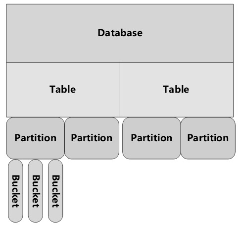

2. Hive架构
   * 主要组成部分有：
     * 元数据管理：存储和管理Hive中数据表的相关元数据，比如各个表的模式信息、数据表及其对应的数据分片信息、数据表和数据分片存储在HDFS中的位置信息等
     * 驱动器：驱动器负责HiveQL语句在整个Hive内流动时的生命周期管理
     * 查询编译器：负责将HiveQL语句编译转换为内部表示的由MR任务构成的DAG任务图
     * 执行引擎：以查询编译器的输出作为输入，根据DAG任务图中各个MR任务之间的依赖关系，依次调度执行MR任务来完成HIveQL的最终执行
     * Hive服务器：提供了Thrift服务接口及JDBC/ODBC服务接口，通过这个部件将应用和内部服务集成起来
     * 客户端：提供了CLI、JDBC、ODBC、Web UI等各种方式的客户端
     * 扩展接口：提供了SerDe和ObjectInspector接口，通过这两类接口可以支持用户自定义函数（UDF）和用户自定义聚合函数（UDAF），也能支持用户自定义数据格式解析。

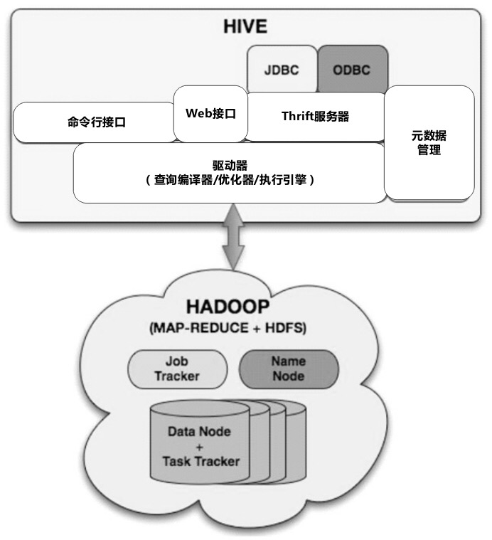

3. HiveSQL查询编译
   * SQL语句解析
     * 使用Antlr将SQL语句转换为抽象语法树（Abstract Syntax Tree，简称AST）
   * 类型检查和语义分析
     * 根据SQL语句中设计的数据表及其字段信息，获取相关的元数据，使用这些元数据来生成逻辑计划
   * 优化步骤
     * 通过对逻辑计划进行优化，使得最终的执行效率更高。
     * 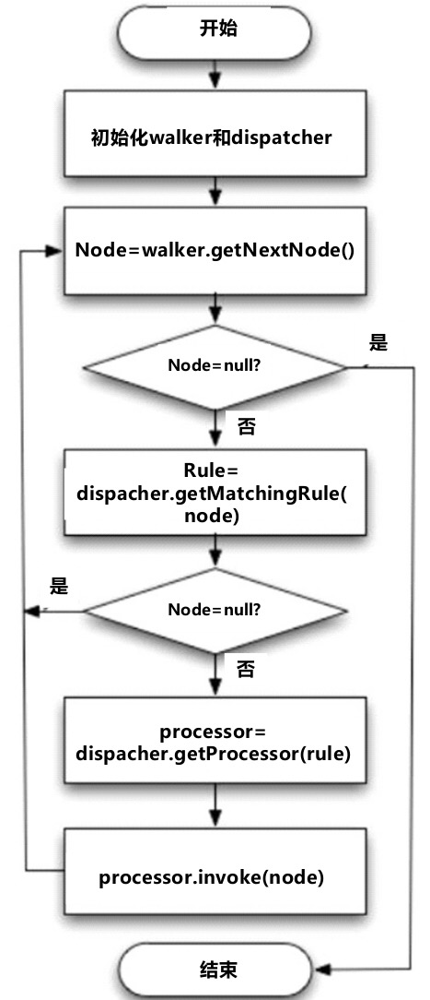
   * 目前hive的优化策略主要涉及如下几类：
     * 列过滤：只选取涉及到的列，其他略过
     * 数据分片过滤：选取涉及到的数据分片，其他略过
     * 谓词下推：将SQL语句中的谓词尽可能向最下端的数据扫面类DAG节点下推，这样在做数据扫描时可以跳过不满足条件的记录。
     * Map Join：也叫做Broadcast Join，如果Map阶段设计Join操作，且两个数据表一大一小，则将小数据表复制到每个Map的内存中来进行Join操作，这样能有效地加快Join的效率
     * Join重排序：在Reduce阶段，对一大一小的数据表类型进行Join操作，将大数据表数据持久化到外存，以此避免消耗内存过大的问题。
   * 物理计划的生成：
     * 对优化后的操作符DAG进行转换，将其转换为由若干MR任务构成的DAG任务图。
4. 制约Hive效率的原因
   * 在MR任务执行期间，Hive需要做很多中间结果持久化到磁盘的操作，比较耗时。
   * Hadoop任务启动与调度花销比较大。

### StingerInitiative

对hive的技术优化图：

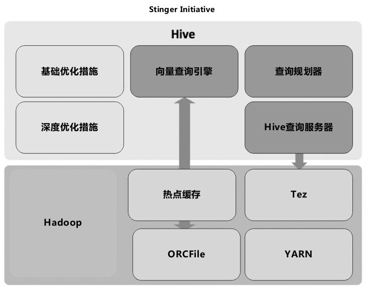


##Shark系数据仓库

Shark能够兼容Hive系统，Shark在整体架构上和Hive比较类似，因为其整体服用了Hive的架构和代码，只是将某些相对底层的模块替换为资深独有的。

Hive体系结构与Shark体系结构的对比：

​	hive:

​		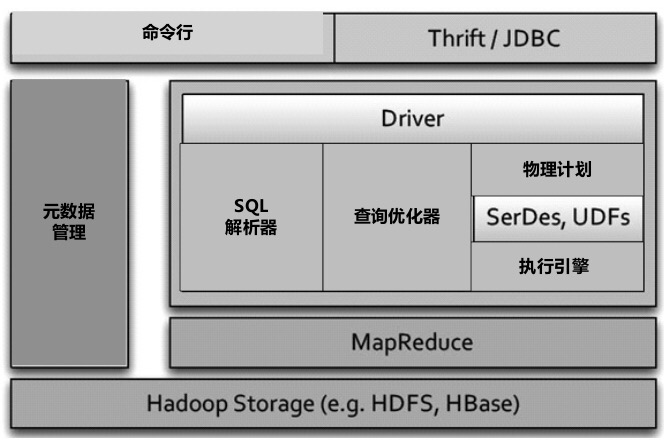

​	Shark:

​		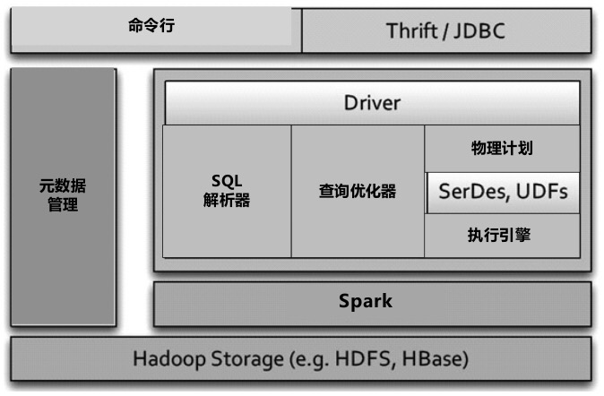

Shark可以将系统西能提升到Hive的若干倍，归纳起来主要靠一下三个因素：

* 采用了基于内存的列簇式存储方案
* 采用了“部分DAG执行引擎（Partial DAG Execution,简称PDE）”，本质上是对SQL查询的动态优化，与很多其他SQL-On-Hadoop系统的基于成本的查询优化功能类似
  * 可以优化Join操作效率，并动态调整操作符运算的并发数
* 数据共同分片（Data Co-Partition）。在语言层级支持数据共同分片，这有利于提升Join的操作效率。
  * 在数据加载的过程中，两个表在进行数据分片时，根据要进行Join操作的列通过哈希等方法把相同Key的不同表记录内容放到同一台机器中存储，这样后续进行Join操作时可以避免Shuffle等网络传输开销。
  * Shark在语言层面支持数据共同分片，这样可以加快Join操作

## Dremel系数据仓库

包括Dremel、PowerDrill、Impala和Presto。从性能角度及发展前景来看，这类数据仓库是最值得关注的。

### Dremel

针对PB级（10亿记录级别）的数据，对于大多数查询，Dremel可以在若干秒内返回查询结果。

之所以能够在如此迅速，主要依赖于一下三点设计：

* 在整个系统的服务器组织架构上借鉴了Google搜索引擎响应用户查询时采用了多级服务树（Service Tree）结构。即所有的服务器组织成若干深度的树形层级结构，用户查询被Dremel系统由上层服务器逐级下推，每层服务器在接收到查询后会对查询进行改写，并推给下一层服务器，在返回结果时则由底层服务器逐级上传，在上传过程中，各级服务器对部分结果进行局部聚集等操作。
* 为终端用户提供了类SQL查询语言，与Pig和Hive不同的是，Dremel并不将用户查询转换为若干MR任务来执行，而是通过Dremel自身的机制（类MPP并行数据库方式）对存储在磁盘中的数据直接进行扫描等数据处理操作，这也是其效率较高的重要原因之一。
* Dremel在数据组织形式上采用了针对嵌套式复杂数据（Nested Data）的行列式混合存储结构，这对提升整个系统性能也是至关重要的。

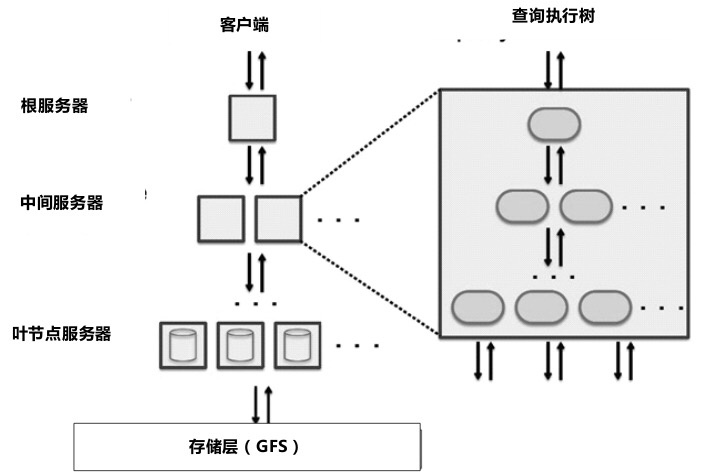

对于服务树，实验表明，三层架构的效率要优于两层架构，比如有大约3000台服务器，可以将其规划为1台根服务器，100台中间服务器加上2900台叶节点服务器。

一般来说，一个SQL查询要处理的数据表子表数目要远远大于可用机器的节点数目，为了能够处理这种情况，Dremel在每个叶子节点上启动多个处理线程，每个SQL语句处理线程称为一个“槽位”（Slot）。比如，一个拥有3000个叶节点服务器的系统，每台服务器启动8个线程，即这个系统总共拥有24000个“槽位”。如果一个数据表包含10万个子表，那么每个“槽位”大约可被分配5个子表作为处理对象。

为了解决拖后腿的任务，就是少数任务完成所需的时间远远超过了平均水平，而这最慢的若干子任务总体上延续了整个任务的执行时间。为了解决这个问题，Dremel的“查询分发器”（Query Dispatcher）负责维护子表执行时间的统计直方图数据，当发现某个线程执行时间超出平均时间较多，则将其调度到另一台机器上执行。

查询语言：

类SQL语言，针对列式嵌套数据形式做出了专门的性能优化。

### PowerDrill

是Google开发的针对大规模数据采用类SQL语句提供查询接口的交互数据分析系统，除了PowerDrill外，Google的Dremel和Tenzing系统也可以提供类似的功能。

与Dremel相比，PowerDrill最大的不同是将待分析的大部分数据加载到内存中进行查询，这决定了PowerDrill的特点：分析速度快，但是处理的数据规模相对有限

PowerDrill提供了可拖曳的可视化分析界面，用户可以通过鼠标拖曳、点击等操作来绘制数据统计分析图表，当用户在操作界面时，PowerDrill自动将用户行为解释转换为针对数据的多条SQL语句，并提交给后台系统进行数据分析，将数据分析结果在界面中展示出来。

其应用场景决定了大部分SQL语句都是Group-By类的查询，PowerDrill在设计系统时也专门针对这一点做了优化。

PowerDrill于2009年年中在Google内部开始使用，每月大约有800位用户发出总共400万条SQL查询。

与Dremel相比，PowerDrill更像一个定制系统，其通用性不如Dremel强，从其内部用户数量也可大致看出这一点。

为了加快SQL的执行速度，PowerDrill采用了以下措施：

* 使用列式存储
* 将待查询的数据大部分加载到内存中
* 快速跳过无关数据，大约有94.2%的数据可被跳过

### Impala

是Cloudera推出的开源的大数据实时交互式查询系统，其基本设计思路借鉴了Google的Dremel和MPP并行数据库，可以将其看做是Dremel的开源改进版。

#### 整体架构

Impala体系结构

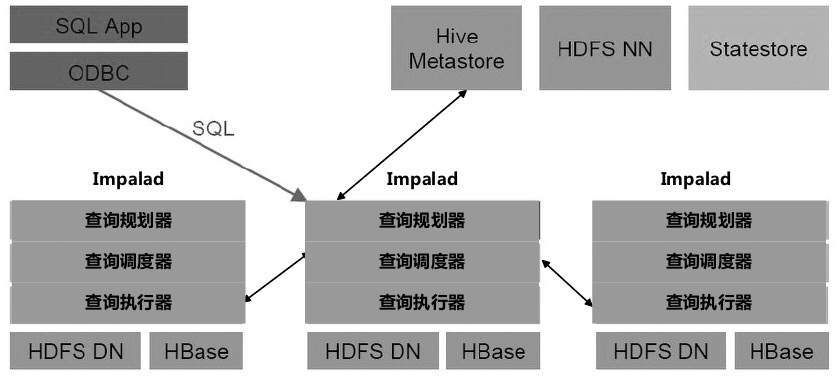

Impala执行SQL语句过程

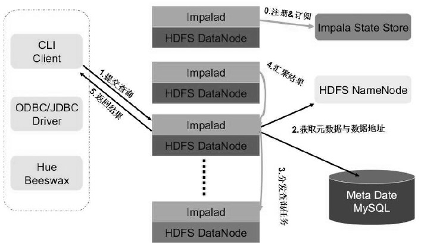

为加快执行速度，Impala还做了很多其他的改进措施：

比如，将数据加载到内存中进行处理，Hadoop文件存储采用Twitter的Parquet列式存储布局，Impalad使用C++编码，绕过NameNode直接读取HDFS数据，查询执行时采用LLVM进行本地代码编译生成和执行等措施。

与MPP并行数据库一样，Impala通过进程间直接通信的方式能够极大地提升系统的执行效率，但也同样有MPP并行数据库的问题，即Impala目前对系统容错支持得不好，查询在执行过程中，如果某个相关的Impalad发生问题，整个查询会以失败告终。此外，Impala暂不支持UDF等功能。

#### Impala的查询计划

Impala的查询计划将SQL语句转换为若干可并行执行的计划片段（Plan Fragment）。

目标：

* 最大程度地进行并行化
* 最大化数据局部性，即计算离数据越近越好，尽可能减少网络数据传输

步骤：

分为顺序执行的两个阶段：

* 单节点计划阶段
  * 将SQL语句解析为操作符节点树，其中的操作符包括：Scan、HashJoin、HashAggregation、Union、TopN和Exchange
* 并行化阶段
  * 对操作符节点树进行划分，划分为若干片段，每个计划片段都可并行执行。

例子：

```sql
SELECT t1.custid, SUM(t2.revenue) AS revenue
    FROM LargeHdfsTablet1
    JOIN LargeHdfsTable t2 ON (t1.id1 = t2.id)
    JOIN SmallHbaseTable t3 ON (t1.id2 = t3.id)
    WHERE t3.category = 'Online'
    GROUP BY t1.custid
    ORDER BY revenue DESC LIMIT 10
```

以上SQL的操作符树：

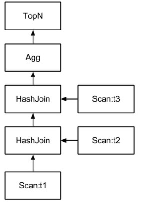

并行化：

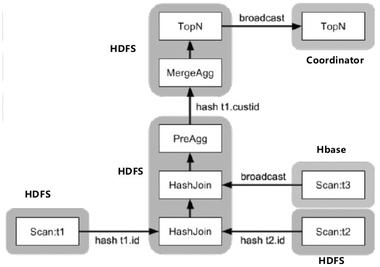

### Presto

FaceBook开源的Hive替代产品，主要用于实时场景的交互式数据分析。

架构：

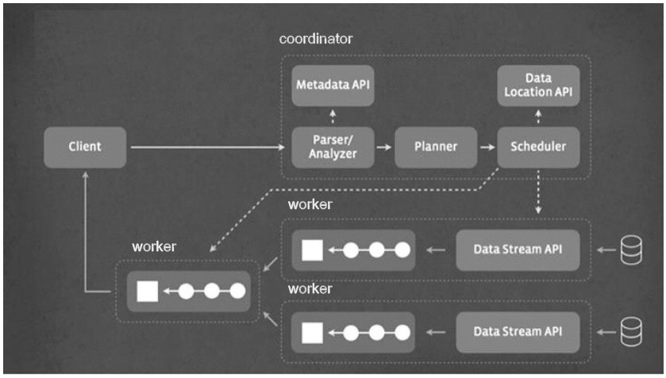

Presto将数据加载到内存进行处理，而且采用MPP并行数据库类似的进程间直接通信的方式来完成查询计划。

Presto为了增强系统可扩展性，增加了数据存储抽象层，通过这层抽象，将数据存储系统和数据分析系统耦合放松，只要心的存储系统提供对元数据、数据存储位置以及数据本身三类信息的存取接口，就可以很方便地使用Presto的SQL接口对不同来源的数据进行统一分析。这个特性代表了大数据交互数据分析系统的未来发展方向之一。

目前Presto可以支持HDFS、HBase、Scribe等多种数据源。

数据存储抽象层：

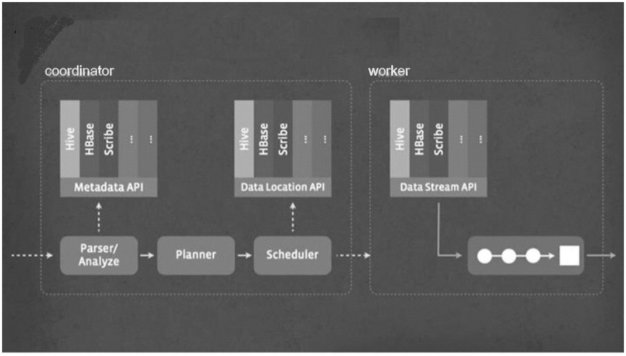


## 混合系数据仓库

混合系数据仓库的出发点是希望能够通过有机集成Hadoop和DBMS，使得整个系统既有Hadoop的高可扩展性和强容错性，又有关系数据库的高效率。

HadoopDB为这类系统的代表，其具体做法是：在分布式集群中，每个数据节点上都部署单机关系型数据库，Hadoop作为任务调度和通信层将关系数据库连接成为有机转增提。

HadoopDB是建立在Hadoop和Hive基础上的，架构（深色部分是HadoopDB的改造模块，浅色部分是Hadoop和Hive部件）：

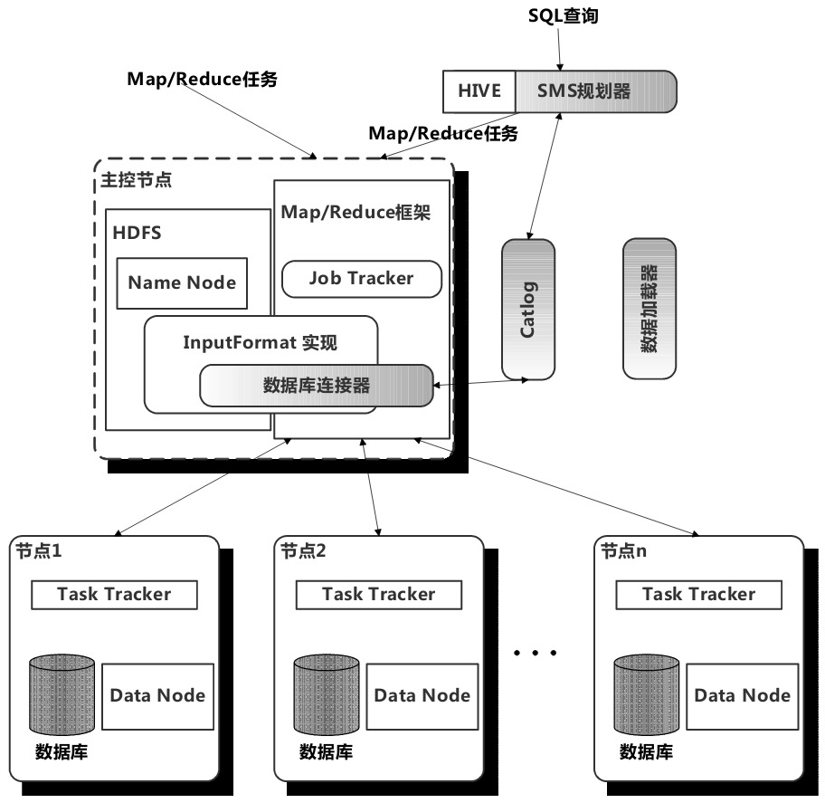

其整体性能要明显弱于MPP数据库，与Hadoop相比，其整体性能提升不大，但是Join类的操作性能可以提升7-10倍。

