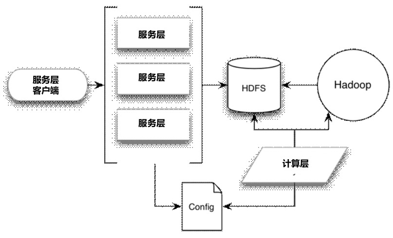
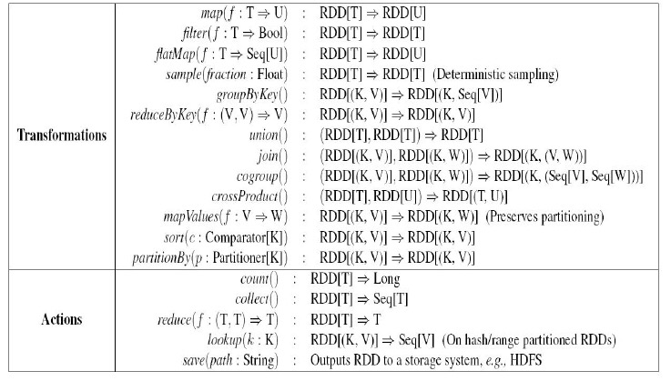
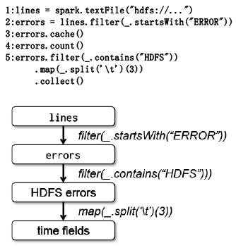

# 15.机器学习：泛型与架构

随着大数据相关技术的快速发展，机器学习作为其中一个知识谱系，必将在今后的大数据处理中发挥越来越重要的作用，因为对于大数据具体应用开发者来说，很大程度上就是使用数据挖掘或者机器学习算法从原始海量数据中挖掘出有意义的数据模式，以此来达到发现数据价值的目的。

很多机器学习算法都有迭代运算的特点，这主要是在损失函数最小化的训练过程中，需要在巨大的参数空间中通过迭代方式寻找最优解，比如主题模型、回归、矩阵分解、SVM以及深度学习等都是如此，以下主要介绍针对此类型的机器学习任务。

## 分布式机器学习

## 分布式机器学习架构

### MapReduce系列

机器学习框架往往采用三层机构，底层是Hadoop提供的MapReduce计算机制，在其上构建一个处于中间层的常用机器学习算法库，最上层往往分为模型训练和在线服务两类功能模块。

最具代表性的包括Cloudera Oryx系统和Apache Mahout系统

#### Oryx

Oryx中间层实现了最常见的一些分类和聚类算法，具体而言，包括用于协同过滤的ALS（Alternating Least Squares）变体算法、用于分类的随机决策森林（Random Decision Forests）算法和用于聚类的K-Means++算法。最上层包括用于模型训练的计算层（Computation Layer）和用于提供在线预测的服务层（Service Layer）。

架构：

### Spark及MLBase

Spark大数据处理协议栈是AMPLab实验室推出的一套与Hadoop 2.0功能类似的完整处理各种大数据应用的整体解决方案，其最核心的部分是适合解决迭代式机器学习类问题的DAG批处理系统Spark，在此基础上，逐渐在其上层开发出流式计算系统D-Stream、图计算系统GraphX、机器学习库MLlib以及MLBase等适用于不同场景的子系统，遂形成了一整套大数据处理技术方案。

#### Spark

本质上是一个DAG批处理计算系统，Spark是集成了RDD模型的DAG批处理系统，它在RDD增加数据复用与系统处理速度的优势基础上，同时还具备传统DAG系统很强的容错性、数据局部性感知的调度策略以及高可扩展性，其处理迭代式机器学习任务的效率比MapReduce原始方式快20倍左右。

RDD支持的运算

RDD示例：

第一行代码根据HDFS的某个Log文件内容生成名叫lines的RDD，第二行代码从lines RDD将Log中以“ERROR”开头的日志过滤出来形成errors RDD，第三行代码显式地将这个新RDD加载到内存，第四行代码返回错误日志的个数，因为这是一个Action操作，所以并不生成新的RDD，而是将其值返回给应用，第五行代码则将包含“HDFS”的错误日志过滤出来，并提取出第三列的时间内容。

