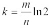
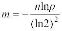
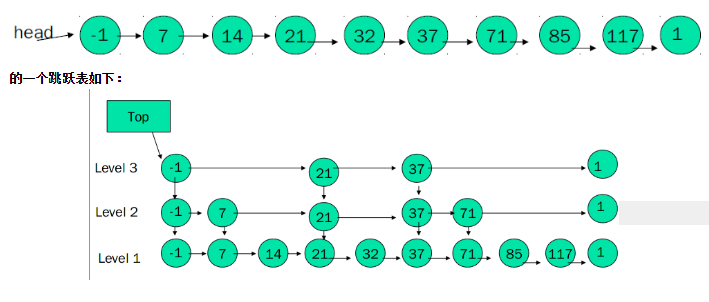
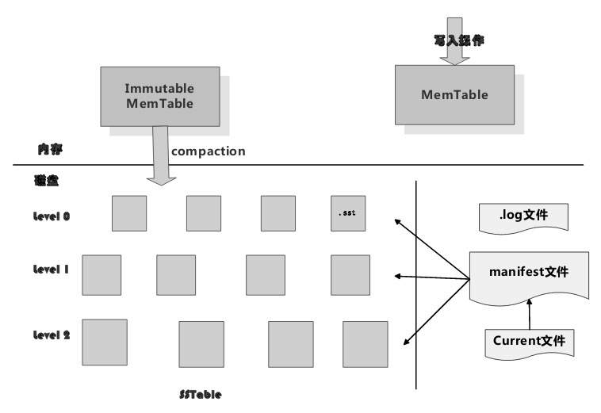

# 大数据常用的算法与数据结构

### 布隆过滤器（Bloom Filter）

用来检测某个元素是否是巨量数据集合中的成员

#####思想：

​	先有一个m位的位数组，将元素值都设为0，用K个哈希函数对集合中的某个元素进行计算，每算一次，得到一个下标，如果这个下标没超过m数组的长度，将就m数组的这个下标位置的元素设置为1，依次计算k次，这样就得到了这个元素在m数组里的表示。

​	当查询的时候，可是对这个元素进行k次的哈希函数的计算，每次得到一个下标，查看m数组的这个下标位置是否为1，如果全部为1，则说明集合中存在这个元素，否则，就不存在。

​	会发生误判，但是不会漏判。

#####实践：

​	最优的哈希函数的个数为(k为哈希函数个数，m为位数组的位数，n为数据集合元素的个数)：

​	

​	已知误判率p和集合大小n，计算给BF分配内存，也就是确定m大小：

​	

##### 改进（计数Bloom Filter）：

​	为了解决原始的布隆过滤器不能删除元素的问题。

​	基本布隆过滤器的基本信息单元是1个比特位，而计数布隆过滤器将基本信息单元扩展为3个或4个比特位，

​	添加元素：用K个哈希函数进行计算后得到相应的结果，将对应位置的值加1即可。

​	删除元素：将对应位置的值减1。

​	查询元素：只要对应位置不为0即可。

​	应用场景：

- 数据量极大且容忍一定误判率的场合
  - google chrome使用它进行恶意URL判断
  - 网络爬虫对已经爬取过的URL进行判断
  - 缓存使用BF来对海量数据进行查找
  - 比特币使用BF对历史交易进行验证
  - 数据库领域使用BF来实现Bloom Join，即加速两个大小差异巨大的表的join过程
  - BIgTable，BF对读操作的效率提升巨大。bigtable将SSTable文件中包含的数据记录key形成BF结构并将其放到内存中，这样就能极大提高查询速度。且发生误判也没影响，顶多是多做了一次磁盘读取操作。	

### SkipList

在维护有序列表高效高效读/写场景下都会采用SkipList

##### 思路

​	如果链表中一半节点能多保留一个指向后续节点之后的指针，那么此时最多遍历[n/2]+1次即可找到任意节点（n为链表长度）

​	与此类似，还可以给部分节点增加3个、4个等更多的指针，令其指向更远的后方节点，这样可以进一步提高查询效率

### LSM树(Log-structred Merge-tree)

适合对写操作效率有高要求的场景，但是代价是读效率有所降低，这往往可以引入Bloom Filter或者缓存等优化措施来读度性能进行改善。

BigTable的单机数据存储引擎、Cassandra、levelDB等使用了LSM树

以levelDB为例：

​	levelDB的结构如下：

​	由内存中的MEMTable + 磁盘上的各级SSTable表构成了LSM树

##### 各level的SSTable表

​	level0 ，key可能重复

​	其他level的key都不会重复

​	当某一个层级的SSTable表达到某个数量，会将其中的某个表跟上级的SSTable表进行合并

​	合并方式是：

​		轮流选一个当前level的SSTable表，与上级的文件进行合并，使用多路归并排序的方式，最终仍然形成有序且不同文件的key不重复的SSTable表

​	这是levelDB的Compaction过程，分为minor compaction 和 major compaction

​	minor compaction是将内存中的Immutable MemTable输出到level0的一个SSTable表

​	major compaction是不同层级的SSTable的compaction。

### Merkle哈希树（Merkle Hash Tree）

用来在海量数据下快速定位少量变化的数据内容（变化原因可能是损毁、篡改或者正常变化等）

在P2P下载系统BitTorrent、Git版本管理工具、比特币以及Dynamo、Riak、Cassandra等NoSql系统中得到应用

##### 基本原理

​	

### Snappy 与 LZSS算法

* Snappy

  * Snappy是Google开源出的高效数据压缩与解压缩算法库，目标并非是最高的数据压缩率，而是在合理的压缩率基础上追求尽可能快的压缩和解压缩速度。且占用cpu时间更少
  * 在google内部广泛使用，也被集成到各种开源系统，比如Hadoop，HBase，Cassandra，Avro等
  * Snappy是基于LZSS算法的，LZSS是LZ77的优化方案，效率更高。
  * 设置最小匹配长度为4，设定哈希表内的字符串片段固定长度为4。

* LZ77/LZSS

  * LZ77是一种动态词典编码

  

  

  ### Cuckoo哈希（Cuckoo Hashing）

  ##### 优点

  * 可以在O(1)时间复杂度查找和删除数据
  * 可以在常数时间内插入数据
  * 有大约50%的哈希空间利用率（经过优化可以达到80甚至90）

  ##### 基本原理

  ​	使用两个不同哈希函数，当插入数据x时，同时计算x的两个哈希函数值，如果对应的哈希控件中任意一个桶为空，则可以将x插入相应位置，如果两者都不空，则选择一个桶，将已经占据这个位置的值y踢出去，由x来占据这个位置。别的值比如y，重复这个步骤。

  ​	有可能导致无限循环，一般做法是设定最大替换次数，当达到最大替换次数时，要么增加哈西空间中桶的数量，要么重新选择合适的哈希函数来替换之前的哈希函数。

  ​	两种常见变体：

  ​		增加哈希函数或每个桶可以存储多个数值。

  ​		使用三个哈希函数，桶利用率可以达到91%

  ​		当每个桶可以存放两个值的时候，桶利用率为80%