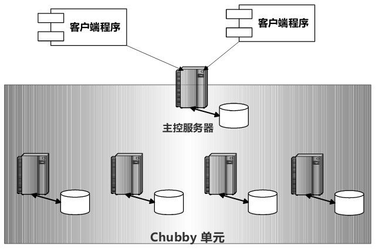
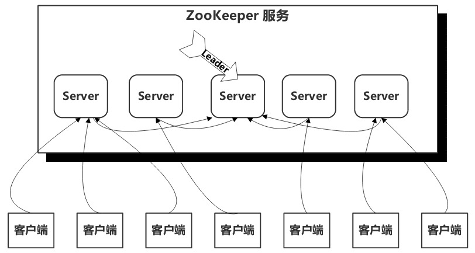
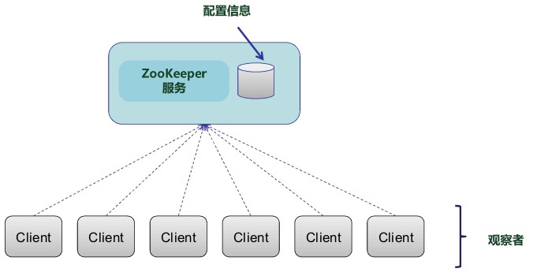
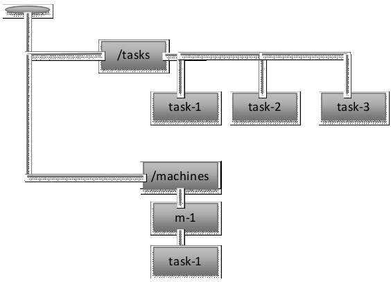

# 分布式协调系统

### Chubby

是google研发的针对分布式系统协调管理的粗粒度锁服务，一个Chubby实例大约可以负责1万台4核CPU机器相互之间对资源的协调管理。

主要功能是让众多客户端程序进行相互之间的同步，并对系统环境或者资源达成一致认知。

Chubby的锁服务是一种“粗粒度”锁。

#####设计哲学：

​	强调协调系统的可靠性与高可用行及语义易于理解，而不追求处理读/写请求的高吞吐量以及在协调系统内存储大量数据。

#####理论基础：

​	以paxos一致性协议为基础，但是做了改造。paxos是完全分布式的，没有中心管理节点，需要通过多轮通信和投票来达成最终一致，所以效率低

​	Chubby出于系统效率考虑，增加了一些中心管理策略，在达到同一目标的情况下改善了系统效率。

##### 体系结构

### Zookeeper

zookeeper是一个高吞吐的分布式协调系统，同一时刻可以相应上万个客户端请求。

zookeeper服务由若干台服务器构成，每台服务器内存中维护相同的类似于文件系统的树形数据结构，其中一台通过ZAB原子广播协议选举作为主控服务器，其他的作为丛书服务器。

客户端可以通过TCP协议连接任意一台服务器，如果客户端是读操作请求，则任意一个服务器都可以直接响应请求；如果是写操作，只能由主控服务器来协调更新操作。

主控服务器通过ZAB协议将数据更新请求通知所有从属服务器，ZAB保证更新操作的一致性和顺序性。（就是从属服务器的数据更新顺序和主控服务器的更新顺序是一样的）

ZAB协议采用简单多票投票仲裁（Majority Quorums）方式，这意味着只有多数投票服务器村花，Zookeeper才能正常运行。比如有2f+1台服务器，那么最多容忍f台服务器失效。

##### 体系结构

数据的同步：

​	客户端在读数据前，可以先调用Sync操作，可以保证客户端一定可以读取到最新状态的数据

zxid：递增的事务id号用来标识事务。

##### 服务器容错

通过"重放日志（Replay log）"结合"模糊快照（Fuzzy Snapshot）"来对服务器故障进行容错。

* 重放日志：
  * 在将更新操作体现在内存数据之前先写入外存日志中避免数据丢失
* 模糊快照：
  * 在周期性对内存数据做数据快照时，并不对内存数据加锁，而是用深度遍历的方式将内存中的树形结构转入外存快照数据中，在快照过程中，有可能内存中的数据发生了更改，而快照中并没有体现更改，这就是“模糊”的含义。由于幂等性，这并不影响最终系统的恢复，只要服务器故障恢复时，加载进“模糊快照”，并根据“重放日志”重新执行一遍操作，系统就会恢复到最新状态。

##### 数据模型

内存数据模型类似于传统的文件系统模式，由树形的层级目录结构构成，其中的节点被称作Znode。

Znode可以是文件，也可以是目录。

Znode节点有两种类型：持久节点和临时节点

客户端可以将节点设置为观察标识，这样当节点内容发生变化（对目录来说是子节点发生变化）时会通知客户端。

节点属性可以设置为自增属性（SEQUENTIAL），即zookeeper会自动将顺序编号赋予节点名字。

##### API

String create(path,data,acl,flags);

void delete(path,expectVersion);

Stat setData(path,data,expectedVersion);

(data,Stat) getData(path,watch);

Stat exists(path, watch);

String[] getChildren(path,watch);

void sync(path);

##### Zookeeper的典型应用场景

1. 领导者选举（Leader Election）
   * 在实现领导者选举时，将临时节点Z1设置为领导者专用节点，里面存储领导者的地址信息和其他辅助信息
   * 某个进程去读取这个节点内容并设置观察标识，成功则说明此时有领导者，并可以从中获取领导者的相关信息，失败说明还没有领导者，这个进程视图自己创建该节点（以临时节点的方式），并将自己的相关信息写入。如果创建成功，则这个进程成为领导者
2. 配置管理（Configuration Management）
   * 
3. 组成员管理
   * 任务目标是动态监控一个组内成员的变化情况，比如有成员加入群组或者离开群组。一个典型的应用场景，比如工作服务器（Worker）的动态添加与故障发现。及时发现新加入的机器，或者发现有故障的机器
4. 任务分配
   * 分布式环境下，将不同的任务负载分别分配到多台可用服务器也是一个比较常见的问题。使用zookeeper可以比较方便地实施这一过程：
   * 
     * tasks节点下是一个个任务，监控进程观察tasks节点的变化。有新增任务时，zookeeper通知监控进程，监控进程找到新增任务并将其分配给机器i
     * machines节点下是机器和对应的任务，意思是将task-i 分配给m-i ， task-i是m-i的子节点，工作服务器监控这个子节点m-i节点，如果发现新增了task-i节点，意味着有新任务到来，就可以读出任务信息并执行任务，执行完成后删掉task-i节点
5. 锁管理
   1. 排它锁：
      * 某个节点下编号最小的节点获得锁
   2. 读/写锁
      * 读锁是并发的，写锁是排他的
      * 实现：写锁的实现与上面大体一样，区别是其创建的子节点以“write”字符串开头，而读是“read”开头，当要实现读锁的时候，首先判断当前有没有编号小于自己的写锁存在，如果存在，就监听离自己的编号最近的写锁，当这个写锁释放了，就可以获取读锁了
6. 双路障同步（Double Barrier）
   * 路障同步，指的是多个并发进程都要到达某个同步点后再继续向后推进
   * 双路障同步，指的是所有并发进程在开始和结束都要进行路障同步，即只有特定数目的进程都到达同步点才各自开始运行和最终结束。
   * 实现方式就是在一个节点下创建子节点，子节点达到一定数目就可以开始执行任务了，任务结束，就删除任务的子节点，节点下的子节点个数为0，说明任务都执行完了

### Zookeeper的实际应用

* HBase
  * 使用Zookeeper进行主控服务器选举与主备切换，作为配置管理在Zookeeper中存储系统启动信息，发现新的子表服务器以及侦测子表服务器是否依然存活等。
* Mesos
  * 利用Zookeeper对主控服务器进行领导者选举与主备机器自动切换，避免主控服务器单点失效
* Storm
  * 利用Zookeeper作为主控进程和工作进程状态信息存储场所，使得即使系统出现故障，也可以将进程快速切换到备份机运行
* Yahoo的Pub-Sub消息服务系统Hedwig
  * 包括存储配置文件、消息话题（Topic）的领导者选举以及自动发现新加入的成员等
* SolrCloud（利用Solr和Zookeeper构建的分布式搜索集群）
  * 索引文件的配置信息存储、集群状态信息的存储及集群成员及其发现与管理等。
* Kafka（LinkedIn的Pub-sub消息服务系统）
  * 自动发现新添加的消息服务器（Broker）和消息消费者（Consumer）；
  * 在消息服务器间进行自动负载均衡；
  * 在Zookeeper里保存消费者和消息队列的映射关系及消费者当前消费信息在消息队列的位置等
* Katta（搭建在Lucene之上的可扩展分布式索引系统）
  * 使用Zookeeper做主控服务器和索引服务器的成员自动管理及任务分配，使用领导者选举来进行主控服务器的主备切换以及索引服务器工作状态等配置信息管理。

