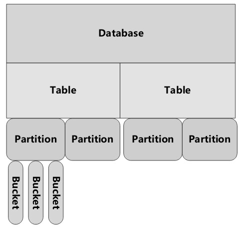
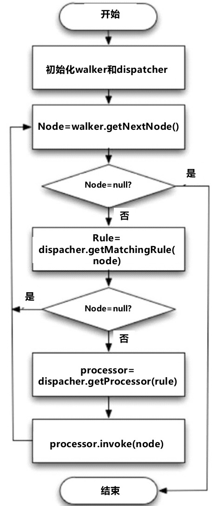
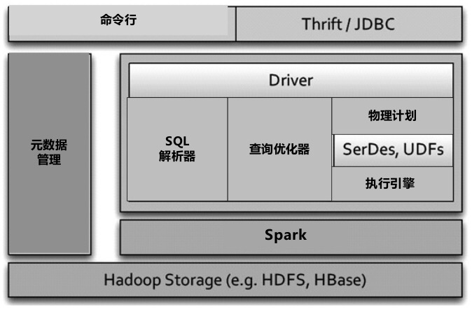

#交互式数据分析

各种SQL-On-Hadoop系统的归类梳理，分为四类：

* Hive系
  * Hive是直接构建在Hadoop之上的早期提出的数据仓库系统，也是目前使用最广泛的SQL-On-Hadoop产品，它和Hadoop的紧密耦合关系既成就了Hive，同时也成为制约Hive发展的瓶颈因素
  * Stinger Initiative是Hive的改进系统
* Shark系
  * 可以理解为Spark系统之上的数据仓库系统。
  * 与Hive类似，同样受到底层系统的制约，这里受到Spark的制约
* Dremel系
  * 目前比较流行的系统如Impala，Presto都被归于此类
  * 从系统架构层面来说，这一类系统是最有发展前景的
* 混合系
  * 混合系是直接将传统的关系数据库系统和Hadoop进行有及混合而构造出的大贵哦数据仓库，其中HadoopDB是最具有代表性的。
  * 从本质上讲，HadoopDB和Hive面临类似的性能瓶颈问题。

## Hive系数据仓库

### Hive

FaceBook设计并开源

查询效率较低，但是开风气之先，后续的数据仓库系统如Stinger Initiative、Shark、Impala、Presto等都在一定程度上借鉴了其思想，甚至大量复用了Hive的代码

Hive的本质思想可以看做：为Hadoop里存储的数据增加模式（Schema），并为用户提供SQL语言，Hive将类SQL语言转换为一系列MR任务来实现数据的处理，以此手段来达到遍历操作数据仓库的目的。

1. 数据组织形式
   * 将存储在HDFS中的文件组织成类似于传统数据库的方式，并为无模式（Schema Less）的数据增加模式信息。除了支持常见的基本数据类型如int、float、double和String外，还支持List、Map和Struct等复杂的嵌套数据类型。
   * 数据组织采取分级结构：
   * table
   * partition（可选）
   * bucket（可选）

2. Hive架构
   * 主要组成部分有：
     * 元数据管理：存储和管理Hive中数据表的相关元数据，比如各个表的模式信息、数据表及其对应的数据分片信息、数据表和数据分片存储在HDFS中的位置信息等
     * 驱动器：驱动器负责HiveQL语句在整个Hive内流动时的生命周期管理
     * 查询编译器：负责将HiveQL语句编译转换为内部表示的由MR任务构成的DAG任务图
     * 执行引擎：以查询编译器的输出作为输入，根据DAG任务图中各个MR任务之间的依赖关系，依次调度执行MR任务来完成HIveQL的最终执行
     * Hive服务器：提供了Thrift服务接口及JDBC/ODBC服务接口，通过这个部件将应用和内部服务集成起来
     * 客户端：提供了CLI、JDBC、ODBC、Web UI等各种方式的客户端
     * 扩展接口：提供了SerDe和ObjectInspector接口，通过这两类接口可以支持用户自定义函数（UDF）和用户自定义聚合函数（UDAF），也能支持用户自定义数据格式解析。

3. HiveSQL查询编译
   * SQL语句解析
     * 使用Antlr将SQL语句转换为抽象语法树（Abstract Syntax Tree，简称AST）
   * 类型检查和语义分析
     * 根据SQL语句中设计的数据表及其字段信息，获取相关的元数据，使用这些元数据来生成逻辑计划
   * 优化步骤
     * 通过对逻辑计划进行优化，使得最终的执行效率更高。
     * 
   * 目前hive的优化策略主要涉及如下几类：
     * 列过滤：只选取涉及到的列，其他略过
     * 数据分片过滤：选取涉及到的数据分片，其他略过
     * 谓词下推：将SQL语句中的谓词尽可能向最下端的数据扫面类DAG节点下推，这样在做数据扫描时可以跳过不满足条件的记录。
     * Map Join：也叫做Broadcast Join，如果Map阶段设计Join操作，且两个数据表一大一小，则将小数据表复制到每个Map的内存中来进行Join操作，这样能有效地加快Join的效率
     * Join重排序：在Reduce阶段，对一大一小的数据表类型进行Join操作，将大数据表数据持久化到外存，以此避免消耗内存过大的问题。
   * 物理计划的生成：
     * 对优化后的操作符DAG进行转换，将其转换为由若干MR任务构成的DAG任务图。
4. 制约Hive效率的原因
   * 在MR任务执行期间，Hive需要做很多中间结果持久化到磁盘的操作，比较耗时。
   * Hadoop任务启动与调度花销比较大。

### StingerInitiative

对hive的技术优化图：

##Shark系数据仓库

Shark能够兼容Hive系统，Shark在整体架构上和Hive比较类似，因为其整体服用了Hive的架构和代码，只是将某些相对底层的模块替换为资深独有的。

Hive体系结构与Shark体系结构的对比：

​	hive:

​		

​	Shark:

​		

Shark可以将系统西能提升到Hive的若干倍，归纳起来主要靠一下三个因素：

* 采用了基于内存的列簇式存储方案
* 采用了“部分DAG执行引擎（Partial DAG Execution,简称PDE）”，本质上是对SQL查询的动态优化，与很多其他SQL-On-Hadoop系统的基于成本的查询优化功能类似
  * 可以优化Join操作效率，并动态调整操作符运算的并发数
* 数据共同分片（Data Co-Partition）。在语言层级支持数据共同分片，这有利于提升Join的操作效率。
  * 在数据加载的过程中，两个表在进行数据分片时，根据要进行Join操作的列通过哈希等方法把相同Key的不同表记录内容放到同一台机器中存储，这样后续进行Join操作时可以避免Shuffle等网络传输开销。
  * Shark在语言层面支持数据共同分片，这样可以加快Join操作

## Dremel系数据仓库

包括Dremel、PowerDrill、Impala和Presto。从性能角度及发展前景来看，这类数据仓库是最值得关注的。

### Dremel

针对PB级（10亿记录级别）的数据，对于大多数查询，Dremel可以在若干秒内返回查询结果。

之所以能够在如此迅速，主要依赖于一下三点设计：

* 在整个系统的服务器组织架构上借鉴了Google搜索引擎响应用户查询时采用了多级服务树（Service Tree）结构。即所有的服务器组织成若干深度的树形层级结构，用户查询被Dremel系统由上层服务器逐级下推，每层服务器在接收到查询后会对查询进行改写，并推给下一层服务器，在返回结果时则由底层服务器逐级上传，在上传过程中，各级服务器对部分结果进行局部聚集等操作。
* 为终端用户提供了类SQL查询语言，与Pig和Hive不同的是，Dremel并不将用户查询转换为若干MR任务来执行，而是通过Dremel自身的机制（类MPP并行数据库方式）对存储在磁盘中的数据直接进行扫描等数据处理操作，这也是其效率较高的重要原因之一。
* Dremel在数据组织形式上采用了针对嵌套式复杂数据（Nested Data）的行列式混合存储结构，这对提升整个系统性能也是至关重要的。