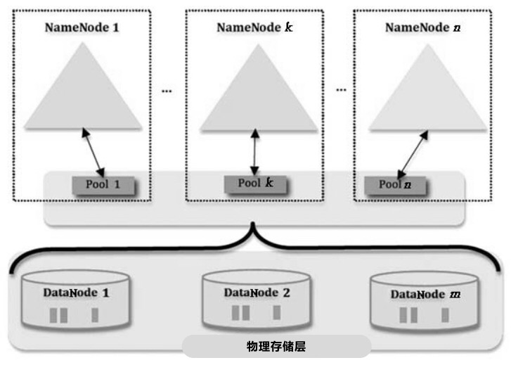
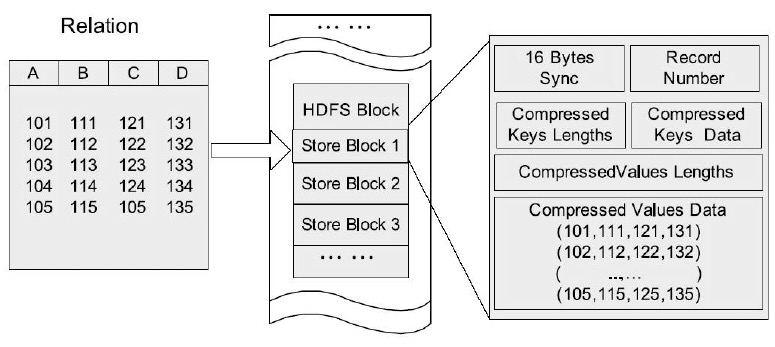
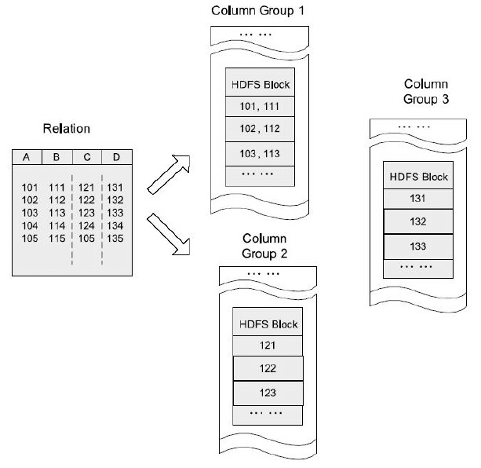
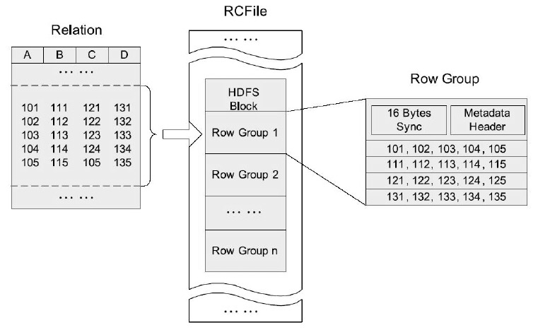
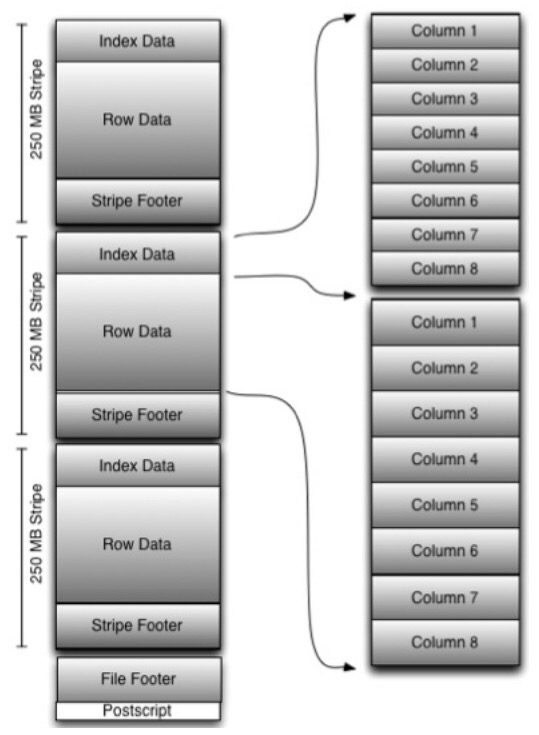
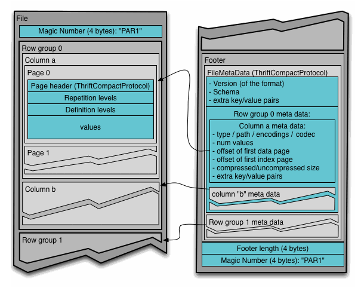

# 分布式文件系统

##Google文件系统

### 设计原则

* 高可用
  * 数据冗余备份、自动检测机器是否还在有效提供服务、故障机器的自动恢复等
* 大文件读/写优化
  * 存储的大都是大文件，在100MB到几个GB之间，要对这种大文件的读/写操作做出优化
* 追加写操作
  * 一般不会岁机械
* 顺序读
  * 大多数读文件操作都是“顺序读”，少量的操作时“随机读”

### 整体架构

GFS命名空间由众多的目录和GFS文件构成，一个GFS文件由众多固定大小的Chunk构成，而每个Chunk又由更小粒度的Block构成，Chunk是GFS中基本的存储单元，而Block是基本的读取单元。

### GFS主控服务器

主控服务器主要从事系统元数据存储管理以及整个分布式系统的管理，比如负载均衡，数据在存储服务器之间迁移，检测新加入的机器以及失效机器等工作。

主要管理的三类元数据：

* GFS命名空间和Chunk命名空间：
  * 主要用来对目录文件以及Chunk的增删改等信息进行记录
* 从文件到其所属的Chunk之间的映射关系
* 每个Chunk在哪台“Chunk服务器”存储的信息

前两类元信息存在日志文件中，并存储多个备份，避免单点失效问题

第三种元信息，也就是chunk和对应的chunk服务器的映射信息，主控服务器在启动时询问每个chunk服务器，之后靠定期询问来保持最新的信息。

此外，主控服务器还承担一些系统管理工作：

​	创建Chunk机器备份数据，在不同Chunk服务器之间进行负载均衡，如果某个Chunk不可用，则负责重新生成这个Chunk对应的备份数据，以及垃圾回收等工作。

为了避免单一主控服务器可能存在的单点失效问题，GFS采用了增加另外一台“影子服务器”的方式，不过这个影子服务器只能代替原来的主控服务器提供客户端读取元数据的功能，其他的功能不具备。

### 系统交互行为

GFS写操作：

GFS还提供了原子文件追加操作，可以支持多客户端并发在某个文件尾部追加记录内容，GFS保证每个客户端能至少成功追加一次。

### Colossus

是Google的下一代GFS分布式文件系统。

对GFS的改造：

​	将单一主控服务器改造为多主控服务器构成的集群。

​	纠删码算法，减少备份数目的情况下达到类似的高可用性要求。

​	客户端也可以管理备份数据的存储地点，使应用可以根据需求来指定数据存放地点，提高读/写效率

## HDFS

类似GFS

为了解决单点失效和水平扩展不佳导致整个文件系统管理文件数目容易达到上限的问题，Hadoop2.0开始提出统一的解决方案：

* 高可用方法（High Availability，HA）：解决单点失效
* NameNode 联盟（NameNode Federation）：解决水平扩展

### 整体架构

其中：Secondary NameNode不是NameNode的热备机，而是定期从NameNode拉取fsimage和editlog文件并对这两个文件进行合并，形成新的fsimage文件并传回给NameNode。本质上Secondary NameNode是个提供检查点功能服务的服务器。

其他的跟GFS的主控服务器和Chunk类似

### HA方案

为了避免“主控服务器”的单点失效问题，Hadoop 2.0给出了一个解决方案。“主控服务器”由Active NameNode（简称ANN）和Standby NameNode（简称SNN）一主一从两台服务器构成，ANN是当前响应客户端请求的服务器，SNN作为冷备份或者热备份机，在ANN发生故障时接管客户端请求并由SNN转换为ANN。

Cloudera在其Hadoop发行版中提供了基于QJM（Quorum Journal Manager）的HA方案。

### NameNode联盟

抽象的NameNode联盟：

实际的NameNode联盟：

所有的DataNode被多个NN共享，仍然充当实际数据块的存储场所。而子命名空间和DataNode之间则由数据块管理层作为中介建立映射关系，数据块管理层由若干数据块池（Pool）构成，每个数据块唯一属于某个固定的数据块池，而一个子命名空间可以对应多个数据块池。

## 文件存储布局

常见的文件存储布局有行式存储，列式存储及混合存储3中类别。不同类别各有其优缺点，适用于不同应用场景。

大数据分析系统中，列式存储和混合式存储方案因为其特殊优点被广泛使用，其中RCFile，ORCFile及Parquet等代表性的方案被广泛集成到各种大数据分析系统的底层架构中。

### 行式存储

HDFS的行式存储布局：

### 列式存储

####1.列族方式

HDFS的列式存储布局(列族的方式)：

BigTable 和 HBase 的底层GFS或者HDFS存储布局就是采用列族方式。

#### 2.Dremel的列存储方式

####3.混合式存储

混合式存储融合了行式和列式存储各自的有点，首先其将记录表按照行进行分组，若干行划分为一组，而对于魅族内的所有记录，在实际存储时按照列将同一列内容连续存储在一起。

典型的混合式存储方案包括RCFile，ORCFile和Parquet。

##### RCFile

#####ORCFile

一种针对RCFile提出的优化的文件存储布局方案

ORCFfile包含若干数据行组，每个数据行组被称为数据带（Stripe），文件尾（File Footer）记录文件中所有数据带的元信息，比如有多少个数据带，每个数据带包含的记录个数及每列采用何种数据压缩算法等信息，同时也记录每列的统计信息，比如该列的最大值、最小值等。附录（Postscript）中记载了压缩算法的参数信息。
每个数据带由3类信息构成：行数据区（Row Data）按列存储该行组记录的实际数据；数据带尾（Stripe Footer）记录压缩数据流的位置信息；索引数据（Index Data）记录了该行组所有记录中每一列的最大值和最小值，另外还记录了行组内部分记录的每一列字段在行数据区的位置信息，即记录的索引信息。利用这些记录索引信息，可以在查找记录时跳过不满足条件的记录，提高执行效率。

##### Parquet

是Twitter参照Dremel的列式存储方案开发的针对Hadoop的混合式文件布局方案，目前已有开源版本。

parquet文件布局：

## 纠删码（Erasure Code）

在仅保存一份数据的情况下，纠删码能够提供数据可靠性功能。

一种常见的做法是：对于热点数据，在大规模存储系统中仍然保留3个备份，而对于冷数据，则只保留一份数据，通过纠删码来保证数据的可靠性。

极大距离可分码（Maximum Distance Separable codes，MDS）是一种非常常用的纠删码

两种经典的纠删码：

* Reed-Solomon（简称RS）编码
* 局部可修复编码（Locally Repairable Codes，LRC）

