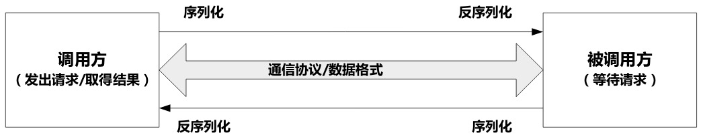
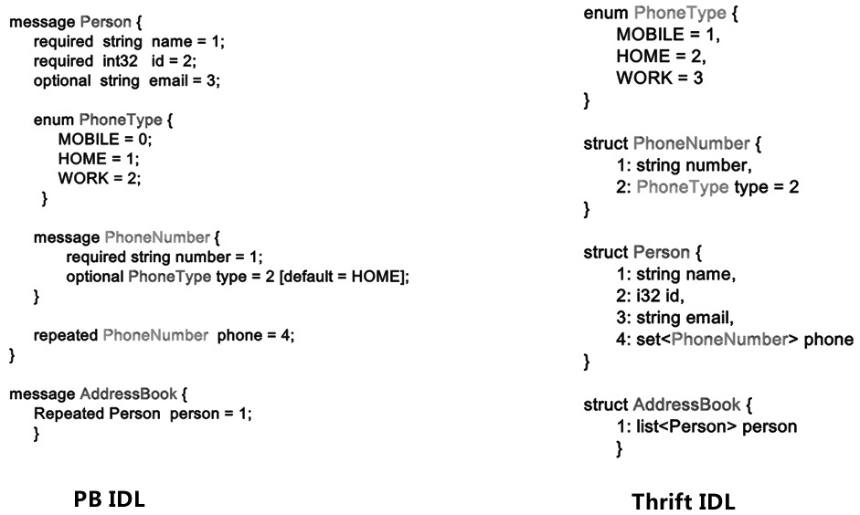
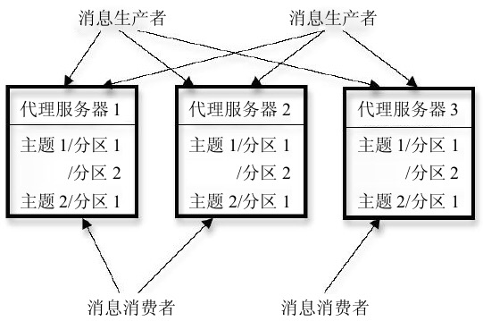

# 分布式通信

### 序列化与远程过程调用框架

三种常用的序列化与RPC框架

* Protocol Buffer 与 Thrift
  * PB是google提供的开源框架，开源版本的功能不全，更多被用于数据序列化方面，比如ActiveMQ就使用PB作为消息存取工具。PB对数据的压缩率是最高的。
  * Thrift是FaceBook开源的序列化与RPC框架，支持十几种常见编程语言，也直接提供RPC调用框架服务。它的使用场景更丰富，许多开源系统融入Thrift作为RPC构件，比如Hadoop/HBase/Cassandra/Hyptertable/Scribe等
  * 使用流程：
    * 使用IDL（接口定义语言）定义消息体以及RPC函数调用接口。
    * 使用工具根据上步的IDL定义文件生成指定编程语言的代码
    * 在应用程序中链接使用上一步生成的代码
  * 两种IDL的比较：
  * 
* Avro
  * 是Apache开源的序列化与RPC框架，使用在Hadoop的数据存储与内部通信中。
  * 使用JSON作为IDL定义语言，无序额外定制IDL解析器
  * 支持动态语言集成
  * 起数据Schema独立于数据并在序列化时置于数据之首

应用场景：

​	如果追求序列化的高效但不适用RPC，可以优先考虑PB；如果需要内建的便捷RPC支持，可以优先考虑Thrift；如果需要和动态语言方便地集成，则可以优先考虑Avro

### 消息队列

目前常见消息队列中间件产品包括：ActiveMQ、ZeroMQ、RabbitMQ和Kafka等

连续并发发送1KB大小的消息，从性能角度看，ZeroMQ性能最优，可达10万TPS(Transaction Per Second,每秒事务处理量)以上，Kafka次之，可达4万TPS左右，RabbitMQ再次，大约1万TPS左右，ActiveMQ最次，性能大约在6000TPS左右。

支持两种模式的队列：

* 消息队列模式
  * 消息生产者将消息存入队列，消息消费者从队列消费消息
* Pub-Sub模式
  * 消息生产者将消息发布到指定主题的队列中，而消息消费者订阅指定主题的队列消息，当订阅的主题有新消息时，消息消费者可以通过拉取（Pull）或者消息中间件通过推送（Push）的方式将消息消费掉。

####Kafka

LinkedIn开源的Pub-Sub机制的分布式消息系统

#####1. 应用场景：

​	Log收集，用户行为实时收集，机器状态监控等，还可以作为流式计算系统的底层构件。

架构：

消息消费者自己存储消费者目前读取到队列中哪个消息的信息

kafka的很多其他的管理信息都存放到Zookeeper而非服务器中，zookeeper存储的管理信息和实现的功能包括：

* 侦测代理服务器和消息消费者的动态加入和删除
* 当动态加入或者删除代理服务器以及消息消费者后对消息系统进行负载均衡。
* 维护消费者和消息Topic以及数据分片的相互关系，并保存消费者当前读取信息的Offset
* 数据副本管理信息

##### 2.ISR副本管理机制

Kafka通过消息副本机制提供了高可用的消息服务，其副本管理单位不是Topic消息队列，而是Topic的数据分片（Partition）。在配置文件中可以指定数据分片的副本个数。

在多个副本里，其中一个作为主副本（Leader），其他作为次级副本（Slave），主副本相应读写操作，刺激副本作为消息消费者从主副本同步数据，当主副本发生故障，某个次级副本被提升为主副本，以此达到整个消息系统的高可用性。

Kafka使用了ISR(In-Sync Replices)的机制来保证数据一致性。用Zab或者Paxos效率比较低，因为如果要支持一个副本容错，这两种机制必须维持三个副本，也就是2f+1，这样就太低效了

##### 3.性能优化

kafka是基于文件系统的消息系统，那么磁盘读写该如何保证性能

普适原则：尽可能避免随机读/写，同事尽可能利用顺序读/写，即连续读/写整块数据。

kafka高效的一个重要原因就是将读/写操作尽可能转换为顺序读/写，比如类似于Log文件方式的文件尾部追加写。

另外，kafka的网络传输采用了Linux操作系统的SendFile调用。

### 应用层多播通信

如何将数据通知到网络中多个接收方，这一般被称为多播通信。

Gossip蜥蜴就是常用的应用层多播通信协议，与其他多播协议相比，其在信息传递的强壮型和传播效率这两方面有较好的折中效果，使得其在大数据领域广泛使用。

####Gossip协议

被称为“感染协议”，所谓“感染”指的是流行病在人群中的传播方式，因为Gossip协议采取的通信方式与流行病传播方式雷同。

Gossip原意是谣言或者小道消息，之所以被称为“Gossip协议”，也是因为其欣喜传播机制和小道消息在人群中的传播方式非常类似。

Gossip协议在大数据系统中的使用：

Dynamo及其模仿者Cassandra、Riak等系统使用Gossip协议来进行故障检测、集群成员管理或者副本数据修复；

#####1.信息传播模型

分成三种：

* 全部通知模型
* 反熵模型（最常用）
  * push模式（最次）：主动向别的节点push信息
  * pull模式（其次）：从别的节点拉取信息
  * push-pull模式（最快）
* 散布谣言模型（表白被拒绝的次数越多越沉默，直到最后完全死心不敢表白）

##### 2.应用：Cassandra集群管理

Cassandra是P2P的列式数据库集群，采用了BigTable的数据模型，底层采用了类似Dynamo的实现机制。因为P2P架构无中心管理节点，所以对于集群管理，比如对是否新加入了机器节点，是否有机器宕机等机器状态信息的维护不可能依赖主控节点来完成，在这种场景下，Cassandra使用Gossip协议来维护集群中机器节点状态信息，这样每个节点都可以最终一致获得整个集群其他节点的全局状态。

本质上使用反熵协议中的Push-Pull模式在节点之间交换最新状态信息。

Gossip协议的另外一个典型应用是P2P环境下为了保证信息一致性而进行的信息同步过程，，例子比如Dynamo首先提出的结合Gossip和Merkle Tree来进行信息一致性同步。