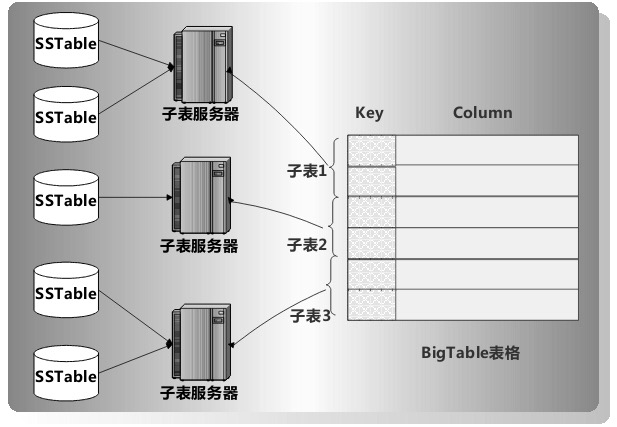
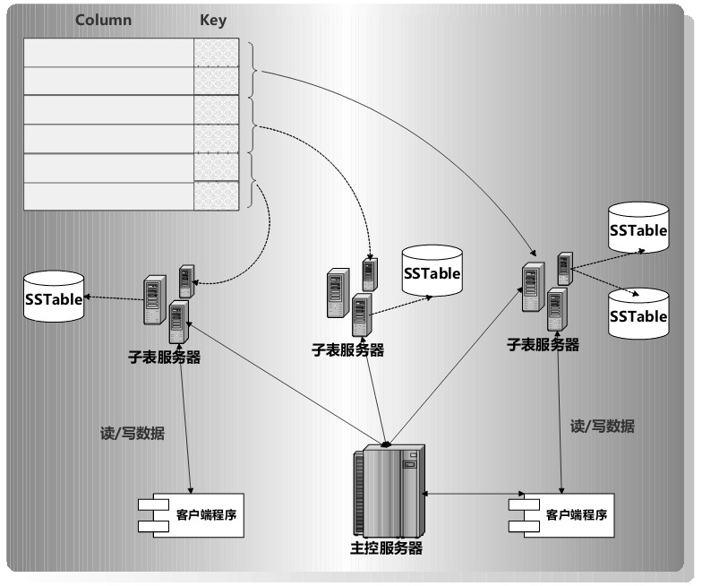
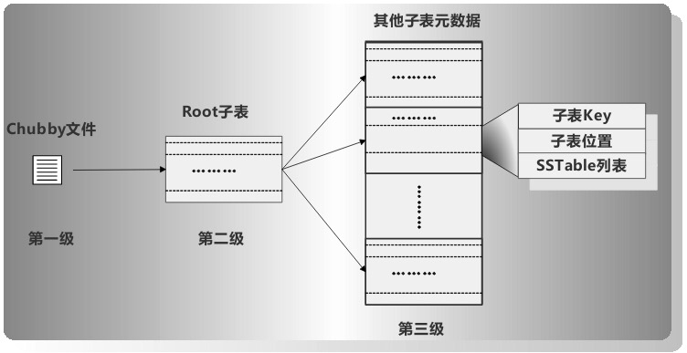
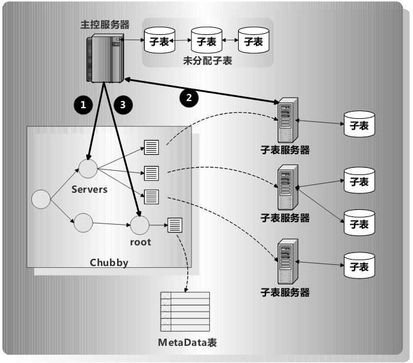
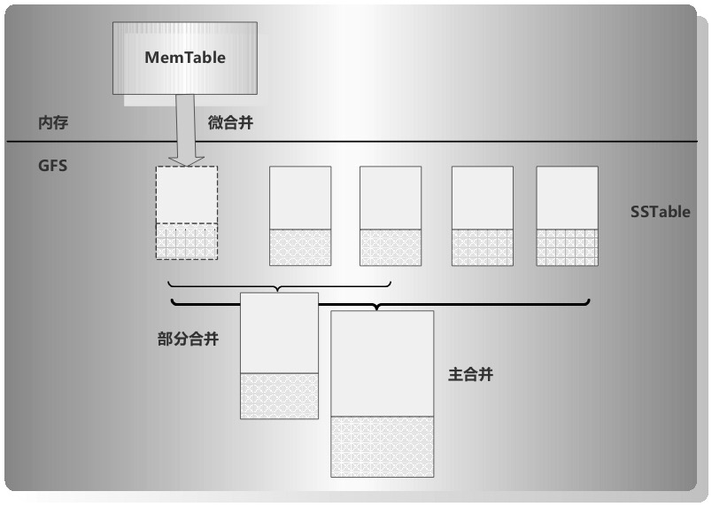
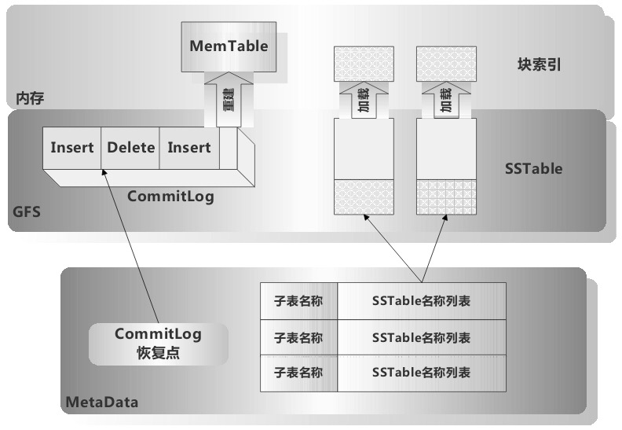

# 列式数据库

## BigTable

###1.BigTable的数据模型

一种针对海量结构化或者半结构化数据的存储模型

BigTable中的列主键包含两级，其中第一级被称为“列家族”（Column Families）。第二级被称为“列描述符”（Qualifier），两者共同组成一个列的主键。即：

`列主键 = "列家族：列描述符"`

BigTable内可以保留同一信息随着时间变化的不同版本，这个不同版本由“时间”维度来进行表达。

实际存储表格信息时，会将表格按照“行主键”进行切割，将一段相邻的“行主键”组成的若干行数据作为一个存储单元，这被称为一个子表，表格由子表构成，每个子表的数据交由“子表服务器”来进行管理：

### 2.BigTable的整体结构

### 3.BigTable的管理数据

### 4.主控服务器

主控服务器在BigTable中专门负责管理工作，比如自动发现是否有新的“子表服务器”加入，是否有“子表服务器”因为各种故障原因不能提供服务，是否有些“子表服务器”负载过高等情况，并在各种情况下负责“子表服务器”之间的负载均衡，保证每个“子表服务器”的负载都是合理的。

当“主控服务器”刚被启动时，需要获知子表的分配情况，下图为主控服务器启动时的运行流程：

### 5.子表服务器

* 更新子表数据

* 读取子表数据

* SSTable合并

  * 微合并
  * 部分合并
  * 主合并

  

* 子表恢复

  

BigTable能提供行级的事务支持,但是跨行跨表的数据一致性无法保证

## PNUTS存储系统

## MegaStore

## Spanner

