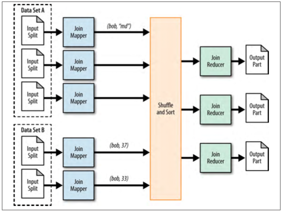
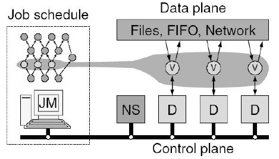

# 大规模批处理系统

## MapReduce计算模型与架构

### MapReduce计算模式

归纳使用MapReduce机制来解决批处理任务中若干最常见的计算模式，在实际应用中大部分ETL任务都可以归结为这些计算模式或者其变体。

#### 求和模式（Summarization Pattern）

* 数值求和
* 记录求和

#### 过滤模式（Filtering Pattern）

从海量数据中筛选出满足一定条件的数据子集。

* 简单过滤
* Top10
  * 在map阶段找到局部top10，在reduce阶段找到全局top10，在实际使用中可以使用排序算法来实现，比如堆排序。

####组织数据模式（Data Organization Pattern）

很多应用需要对数据进行整理工作，比如转换数据格式、对数据进行分组归类、对数据进行全局排序等，这是组织数据模式发挥作用的应用场景。

* 数据分片
  * 将同一天的数据放到一起以进一步做后续数据分析
  * 将相同地区的记录分类到一起。
  * 中信放在Partition策略设计上
* 全局排序
  * map阶段将要排序的key,加上value原样输出即可
  * reduce如果只有一个，那么不需要做额外操作就可以直接得到全局排序结果
  * 如果有多个reducer，那么可以在partition做配置，比如将1-10000分给reducer1,10001-20000分给reducer2...

#### Join模式（Join Pattern）

所谓“join”，就是将两个不同数据集合内容根据相同外键进行信息融合的过程。

* Reduce-Side Join
  * 是解决数据集合Join操作的一种比较通用的方法
  * 
* Map-Side Join
  * 在有些场景下，两个需要Join的数据集合L和R，一个大一个小（假设L大R小），而且小的数据集合完全可以在内存中放入，此时，只需要采用一个Map-Only MapReduce任务即可完成Join才做。Mapper的输入数据块是L进行拆分后的内容，而由于R足够小，所以将其分发给每个Mapper并在初始化时将其加载到内存存储，一般比较高效的方法是将R存入内存哈希表中，以外键作为哈希表的Key，这样即可一次读入L的记录并查找哈希表来进行Join操作。
  * 高效
  * 但是必须满足R小到可以在内存存储这一前提条件。

## DAG计算模型

DAG是有向无环图（Directed Acyclic Graph）

### DAG计算系统的三层结构

* 最上层：应用表达层
  * 通过一定手段将计算任务分解成由若干子任务形成的DAG结构，这层的核心是表达的便捷性，主要目的是方便应用开发者快速描述或者构建应用。
* 最下层：物理机机群
  * 即由大量物理机器搭建的分布式计算环境，这是计算任务最终执行的场所
* 中间层：DAG执行引擎层
  * 主要目的是将上层以特殊方式表达的DAG计算任务通过转换和映射，将其部署到下层的物理机集群中来真正运行。
  * 是DAG计算系统的核心部件，计算任务的调度、底层硬件的容错、数据与管理信息的传递、整个系统的管理与正常运转等都需要由这层来完成

### Dryad

是微软的批处理DAG计算系统，在实现时以共享内存、TCP连接以及临时文件的方式来进行数据传递，绝大多数情况下采用临时文件的方式。

#### 1.Dryad整体架构

#### 2.Dryad的图结构描述

#### 3.Dryad的任务执行

。。。

### FlumeJava和Tez

