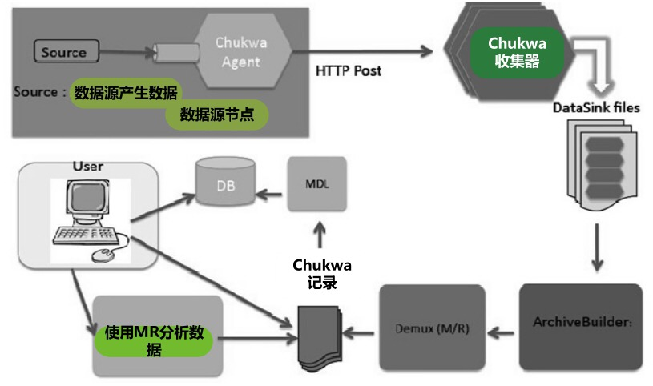
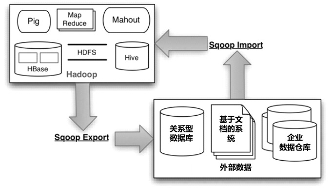

# 数据通道

如何收集汇总分散在各处的原始数据（由分散到集中）

如何将数据源的数据变化及时通知对此数据有消费需求的各个子系统（由集中到分散）

不同类型存储系统之间的数据迁移

### Log数据收集

设计点：

* 低延迟
* 可扩展性
* 容错性

#### Chukwa

建立在Hadoop智商的用于针对大规模分布式系统Log收集与分析用途的Apache开源项目。

基本策略：首先收集大量单机的Log增量文件，将其汇总会形成大文件，之后再利用MR任务来对其进行加工处理。

不仅仅定位于数据收集，也在后端集成数据分析和可视化界面。

架构：

因为涉及到MR任务，效率不高，且其想要融合前端收集和后端分析，功能不明确，且在优化上，前后端的优化方向是不一致的，造成效率的地下，前景堪忧

### Scribe

Facebook开源，可以从集群中的机器节点收集汇总Log信息并送达中央数据存储区（HDFS或NFS），之后可以对其进行进一步的分析处理。它具备高扩展性和高容错能力。

架构：

### 数据总线

数据总线的作用就是能够形成数据变化通知通道，当集中存储的数据源（往往是关系型数据库）的数据发生变化时，能尽快通知对数据变化敏感的相关应用或者系统构件，使得它们能尽快捕获这种数据变化。

LinkedIn的Databus数据总线系统：

设计数据总线系统要关注以下三个特性：

* 近实时性
* 数据回溯能力：有时订阅数据变化的应用可能发生故障，导致某一时间段内的数据没有接收成功，此时希望数据总线能够支持数据回溯能力，即应用可以重新获取指定时刻的历史数据变化情况。
* 主题订阅能力

两种实现方式：

* 应用双写
* 数据库日志挖掘

具体实现：

##### Databus

架构：

Relay是一个环状的内存缓冲区，用来存储一定量的最新更新，当更新数据超过缓冲区大小的时候，相对旧的数据会被新的数据覆盖。

Bootstrap是相对长期的保存数据的地方，当客户端处理消息速度比较慢，内存区已经没有客户端想要的数据的时候，可以到Bootstrap去获取数据，另一种情况是新加入的机器也会先去Bootstrap获取数据。

Bootstrap架构：

Bootstrap像其他客户端一样侦听中继器的数据变化，并采用Log Writer将更新数据写入增量更新存储区（Log Storage），在具体实现时使用了MySQL数据库。Log Applier批量地将更新合并进入快照存储区（Snapshot Storage），形成不同时间点的快照，具体实现时快照是使用文件方式存储的。当新客户端发出请求时，首先从快照存储区读取某个时间点T的数据快照，然后从增量更新存储区读取时间点T之后的增量更新，之后即可转向中继器去捕获最新的数据变化信息。

Kafka也可以做类似Databus的数据总线

目前LinkedIn内部将Databus专用于数据库的变化通知，而Kafka则使用在应用层间的消息与数据通信。

##### Wormhole

架构：

### 数据导入/导出

不同存储系统之间的数据迁移问题：

​	关系型数据库和HDFS之间的数据导入/导出

##### Sqoop

是专门在hadoop和其他关系型数据库或者NoSql数据库之间进行相互之间数据导入和导出的开源工具。

在其内部实现时，具体的导入/导出工作是通过可以连接并操作数据库的MR任务完成的。

Sqoop的功能：

sqoop2体系结构：

