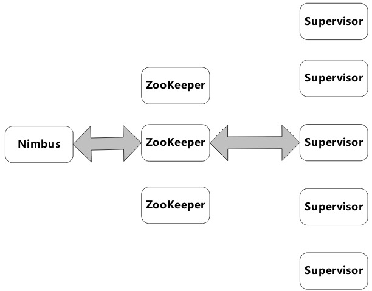
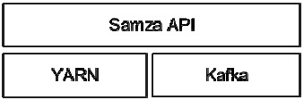

# 流式计算

在很多应用场所，对大数据处理的计算时效性要求很高，要求计算能够在非常短的时延（Low Latency）内完成，这样能够更好地发挥流式计算系统的威力。

优秀的流式计算系统应该具备以下特点：

1. 记录处理低延迟
2. 极佳的系统容错性
3. 极强的系统扩展能力
4. 灵活强大的应用逻辑表达能力

## 流式计算系统架构

常见的流式计算系统架构分为两种：主从模式和P2P模式。大多数系统架构遵循主从模式，主要是因为主控节点做全局管理比较简洁，比如Storm，MillWheel和Samza都是这类架构。

### 主从架构

Storm架构中存在两类节点：主控节点和工作节点，如图12-1所示。主控节点上运行Nimbus，其主要职责是分发计算代码、在机器间分配计算任务以及故障检测等管理功能，类似于Hadoop 1.0中的JobTracker的角色。集群中的每台工作服务器上运行Supervisor，其监听Nimbus分配给自己的任务，并根据其要求启动或者停止相关的计算任务，一个Supervisor可以负责DAG图中的多个计算任务。

ZooKeeper集群用来协调Nimbus和Supervisor之间的工作，同时，Storm将两者的状态信息存储在ZooKeeper集群上，这样Nimbus和Supervisor都成为无状态的服务，从而可以方便地进行故障恢复，无论哪个构件发生故障，都可以随时在另外一台机器上快速重新启动而不会丢失任何状态信息。

### P2P架构

S4采用了P2P架构，没有中心控制节点，集群中的每台机器既负责任务计算，同时也做一部分系统管理工作，每个节点功能对等，这样的好处是系统可扩展性和容错性能好，不会产生主从模式的单点失效问题，但是缺点是管理功能实现起来比较复杂

### Samza架构

是在Kafka和YARN之上封装了流式计算语义API的系统，其中Kafka负责数据流的存储与管理，YARN负责资源管理、系统执行调度和系统容错等功能，Samza API则提供了描述执行流式计算DAG任务的接口。由此可以看出，其本质上是类似于MR2.0一样运行在YARN统一框架下的具体计算框架

Samza体系结构：

## DAG拓扑结构

### 计算节点

分为两类：

一类是整个计算任务的数据输入节点，负责和外部其他系统进行交互，并将输入数据接入流式计算系统，Storm中将这类计算节点称为Spout，MillWheel将这类计算节点称为Spout

第二类节点是完成计算任务的任务计算节点，在Storm中被称为Bolt，整个计算任务就是由若干此类节点通过流经计算节点的流式数据串接起来完成的。每个此类计算节点往往从上游节点接收数据流，对数据流进行特定的计算处理，然后产生衍生数据流，并分发到其下游的计算节点

### 数据流

DAG拓扑结构中的边是由连续不断进入流式计算系统的数据构成的数据流，这对所有的流式计算系统都是一样的，区别在于表达数据流中数据的方式各异。

Storm将每条数据用数据元组（Data Tuple）来表示，虽然并未明确指明数据主键，但是实际可以将主键放在元组中特定的位置来对主键和其他内容进行区分，接收到数据的计算节点可以从元组对应的内容中读出所需的数据。

### 拓扑结构

DAG结构中最常见的基本拓扑结构包含：流水线、乱序分组、定向分组和广播模式

Storm是在图拓扑结构定义方面最灵活的，除了能够提供上述几种基本的拓扑连接方式，还提供了其他几种不常见的模式。

Storm和MillWheel通过程序语言对其拓扑结构进行明确编码。

Storm是从全局出发来定义整体的拓扑结构，通过程序代码显式地指出全局的拓扑结构

## 送达保证（Delivery Guarantees）

