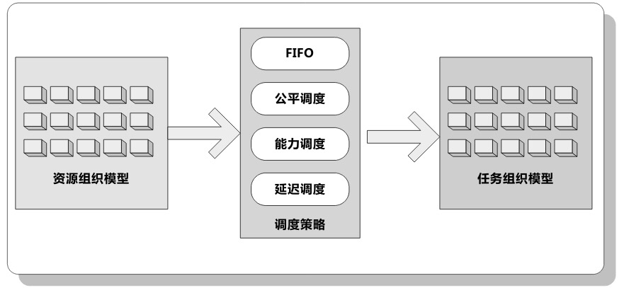
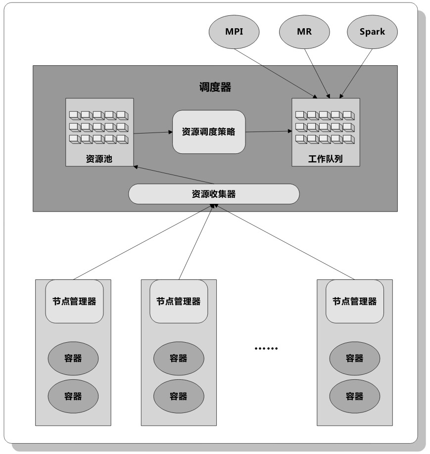
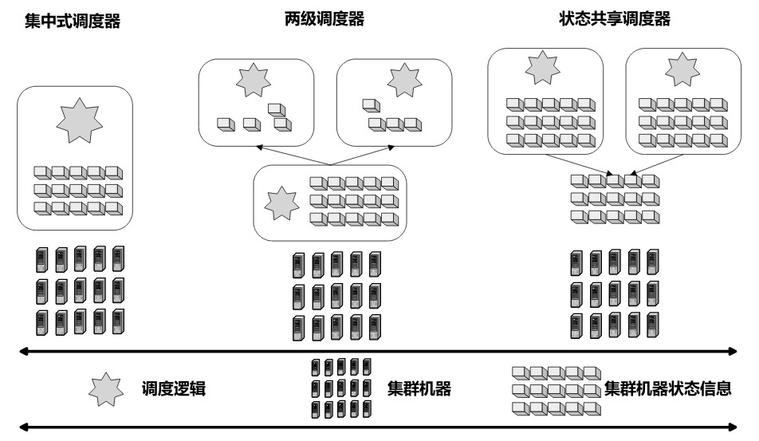
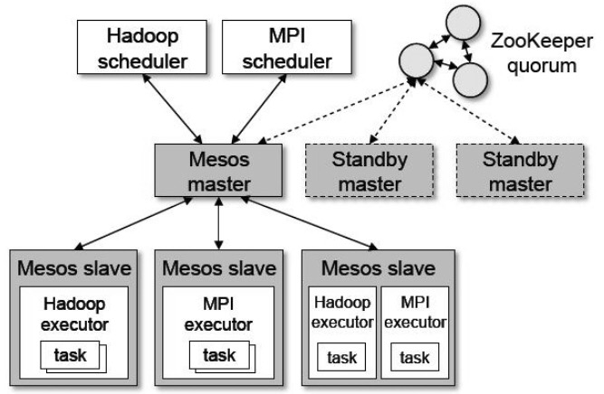
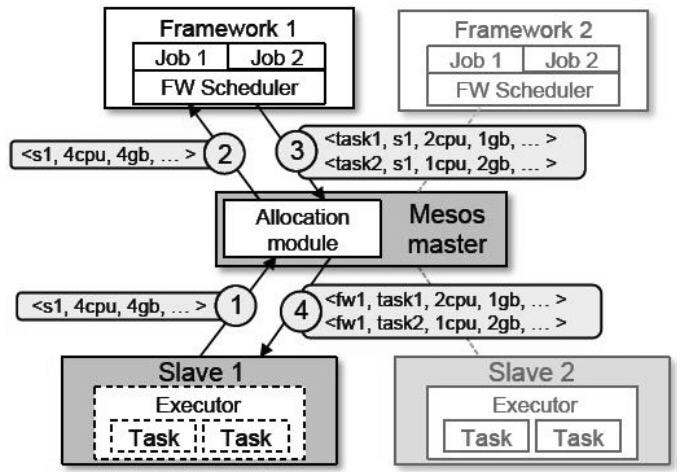
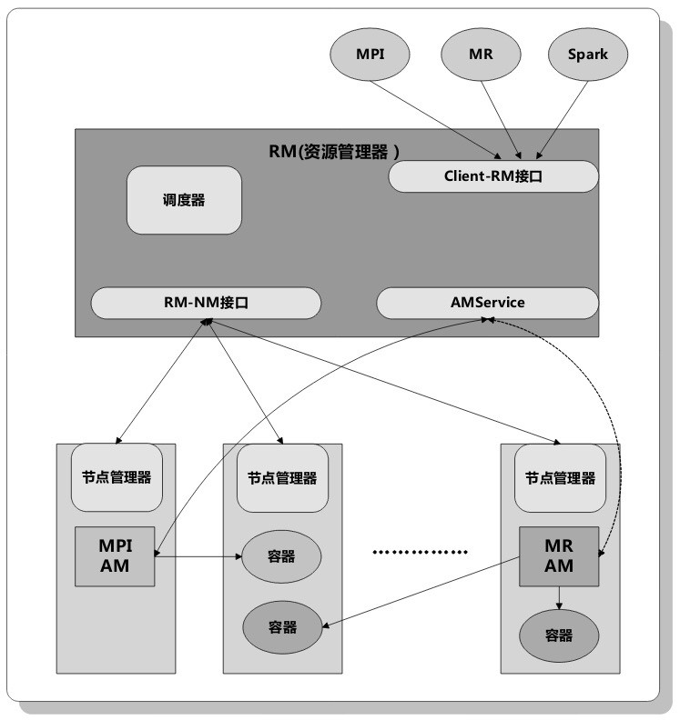
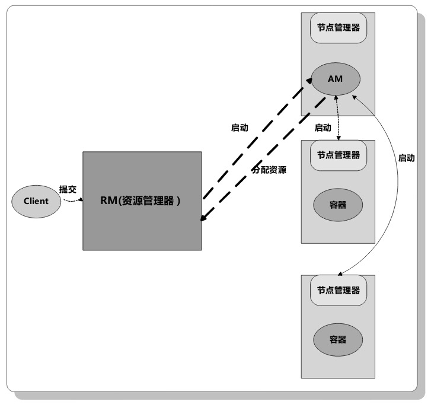

# 集群资源管理与调度

### 抽象模型

##### 概念模型

常见资源：内存、CPU、网络资源、磁盘I/O

三要素：

 * 资源组织模型：将集群中当前可用的各种资源采用一定的方式组织起来，以方便后续的资源分配过程
 * 调度策略：以一定方式将资源分配给提交到系统的任务，常见的调度策略包括FIFO、公平调度、能力调度、延迟调度等
 * 任务组织模型：将多用户提交的多任务通过一定方式组织起来，以方便后续的资源分配

图示：

​	

#####通用架构

抽象的通用资源管理框架：

### 调度系统设计的基本问题

##### 资源异质性与工作负载异质性

*  资源异质性：
  * 机器配置不同，资源就不同
* 工作负载异质性
  * 因为各种服务和功能的不同，对资源的需求差异很大

##### 数据局部性

​	移动计算而不是移动数据

资源管理与调度语境下的三种类型的数据局部性

* 节点局部性（数据与计算就在一台机器上，最优）
* 机架局部性（数据与计算在一个机架上，其次）
* 全局局部性（数据与计算不在一台机器也不在一个机架，最次）

##### 抢占式调度与非抢占式调度

* 抢占式：高优先级抢占低优先级的资源，低优先级停止计算，然后重新申请资源
  * 强调高优先级任务执行效率
* 非抢占式：只从空闲资源中申请资源
  * 强调公平

##### 资源分配粒度

计算任务由两层结构组成：

* 作业级（job）
* 任务级（task）

两种资源分配粒度方式：

* 群体分配（全分或不分）：需要将作业的所需资源一次性分配完成（如MPI任务）
* 增量满足式分配策略：对于某个作业来说，只要分配部分资源就能启动一些任务开始运行，随着空闲资源的不断出现，可以逐步增量式分配给作业其他任务以维持作业不断向后推进（如MapReduce等批处理任务）
* 一种特殊的满足增量式分配策略被称为”资源储备“策略
  * 指的是只有分配到一定量的资源作业才能启动，但是在未获得足够资源的时候，作业可以先持有目前已分配的资源，并等待其他作业释放资源，这样从调度系统不断获取新资源并进行储备和积累，直到分配到的资源量达到最低标准后开始运行

##### 饿死（Starvation）与死锁（Dead Lock）问题

* 饿死：
  * 指这个计算任务持续长时间无法获得开始执行所需的最少资源量，导致一直处于等待执行的状态。
* 死锁：
  * 由于资源调度不当导致整个调度系统无法继续正常执行，比如上面的“资源储备”策略就有可能导致调度系统进入死锁状态。

##### 资源隔离方法

YARN和Mesos采用了将各种资源封装到容器中的细粒度资源分配方法

整个分布式资源管理系统管理了众多的资源，为了不让任务之间互相干扰，需要提供容器间的资源隔离方法。

目前资源隔离最常用的手段是Linux容器（Linux Container，LXC），YARN和Mesos都采用了这种方法

开源实现：

​	Google的lmctfy

​	Cloud Foundry的Warden

### 资源管理与调度系统范型

按照宏观运行机制分类为三种：

* 集中式调度器
* 两级调度器
* 状态共享调度器

如图：

##### 中央调度器：

一个中央调度器管理所有资源分配

比较适合小规模集群下的资源调度与管理

#####两级调度器：

两级调度器将整个系统的调度工作分为两个级别：

* 中央调度器
  * 可以看到集群中的所有机器的可用资源并管理其状态，它可以按照一定策略将集群中的所有资源分配给各个计算框架，是一种粗粒度的资源调度方式。
* 框架调度器
  * 各个计算框架在接收到所需资源后，可以根据自身计算任务的特性，使用自身的调度策略来进一步细粒度地分配从中英调度器获得的各种资源。

Mesos、YARN和Hadoop On Demand系统是3个典型的两级调度器系统。

比较适合负载同质的大规模集群应用场景

##### 状态共享调度器

是Google的Omega调度系统提出的一种资源管理与调度范型，在这种调度范型中，每个计算框架可以看到整个集群中的所有资源，并采用相互正经的方式去或取自己所需资源，根据自身特性采取不同的具体资源调度策略，同时系统采用了乐观并发控制手段解决不同框架在资源竞争过程中出现的需求冲突。

适合负载异质性较强且资源冲突不多的大规模集群应用场景（如果资源冲突，那高优先级的任务总能先获取资源，而低优先级的任务有”饿死“的风险）

### 资源调度策略

多用户多作业环境下，如何将集群资源在它们之间进行分配需要特定的策略。

Hadoop实现了FIFO，公平调度器和能力调度器。

##### FIFO

按作业提交时间先后或优先级次序将其放入线性队列相应位置，在资源调度时按照队列先后顺序，先进先出的进行调度与资源分配，是Hadoop的默认策略

##### 公平调度器

将用户的任务分配到多个资源池，每个资源池设定资源分配最低保障和最高上限，管理员也可以指定资源池的优先级，优先级高的资源池会被分配更多的资源，当一个资源池资源有剩余时，可以临时将剩余资源共享给其他资源池。

支持抢占式

##### 能力调度器

适合用户量众多的应用场景。更强调资源在用户之间而非作业之间的公平性。

将用户和任务组织成多个队列，每个队列可以设定资源最低保障和使用上限，当一个队列的资源有剩余时，可以将剩余资源暂时分享给其他队列。调度器在调度时，优先将资源分配给资源使用率最低的队列。队列内部，按照作业优先级的先后顺序遵循FIFO策略进行调度

##### 延迟调度策略

在hadoop的公平调度器和能力调度器及Mesos中都有采用。

如果任务i将要被分配资源，如果当前资源不满足数据局部性的要求，则暂时跳过i，给后续的任务分配资源，如果跳过k次后仍然不满足数据局部性，则被迫接受当前资源来启动任务执行

##### 主资源公平调度策略（Dominant Resource Fair Scheduling）

是Mesos采取的公平调度策略，也是最大最小公平算法的一个具体体现。

最大最小公平算法的基本思想：最大化目前分配到最少资源量的用户或者任务的资源量。

对每个用户，DRF分配给这个用户的所有资源的各自分享量（Share），而一个用户的各个资源分享量中的最大值被称作“主分享量”（Dominant Share），“主分享量”对应的资源被称为这个用户的“主资源”（Dominant Resource）。不同用户可能拥有不同的“主资源”。

##### 其他几种针对Hadoop的改进资源调度策略

* 资源感知调度策略
* 动态优先级调度策略
* 最长时间预估调度策略
* 约定截止时间调度策略
* 。。。

### Mesos

#####Mesos架构：

#####Mesos资源调度实例：

##### 适用场景与注意点

* 适合不同框架任务同质化场景，尤其是大部分都是短作业的情景（比如Hadoop等批处理任务）
* Mesos不支持抢占式调度，资源分配出去后只能等待任务运行结束后自行释放
* 计算框架只能被动接受被分配的资源，这样很难保证数据局部性，缓解：
  * 框架可以拒绝所分配资源以及增加“过滤器”（Filter）机制。

###YARN

一个独立的资源管理系统，跟Mesos一样也是两级调度器的典型

* Resource Manager：负责整个集群的资源管理功能，类似于Mesos中的主控服务器
* ApplicationMaster：负责完成任务所需资源的申请管理与任务生命周期管理功能。类似Mesos的二级调度

##### 跟Mesos的区别

YARN的中央调度器支持“抢占式调度”以及ApplicationMaster可以在向RM申请资源时提出明确的数据局部性条件

#####架构

##### 执行过程：

由于代表了Hadoop的未来发展趋势，与Mesos相比更加活跃，发展前景更乐观。目前已经有很多大数据计算框架移植到YARN平台下，比如MR、流式计算系统Storm和Samza、图计算系统Giraph、DAG计算系统Tez等

